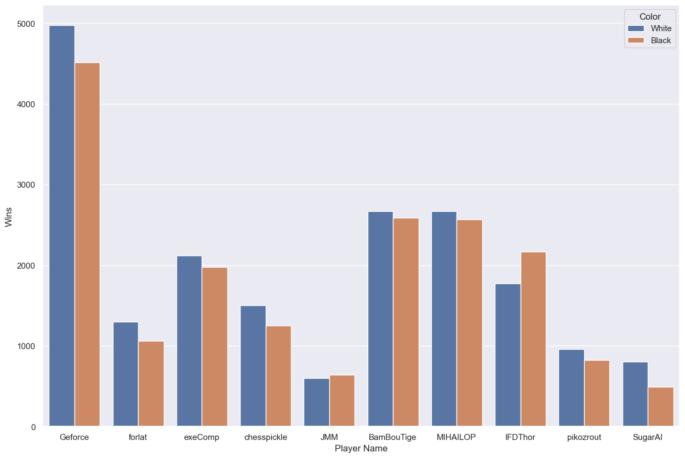

# Dissection of the FICS 2021 Dataset

I have always been around a chess board since an early age. My father and grandfather and extended family would have home tournaments every family function. Chess on the computer has come a long way since first playing on the XT.
The game has always intrigued me, the players all the more as they calculate the best lines to play up to 15 moves ahead even more.
Having frequented the Free Internet Chess Server (FICS) a few years ago, it was a pleasant surprise that a dataset was available, and I was intrigued all over again.

## Files
```
root
|
fics-chess-2021.ipynb       # Notebook with the data analysis code
|
Chess2021.csv               # The FICS 2021 games dataset
|
chess-eco-reference.csv     # ECO codes and names for openings
|
README.md                   # This file
```

## Summary

We wanted to see if we could answer these questions using this dataset.

### Is there an opening which has more wins for a particular color?

Queen's Pawn Game was played the most times across the different game types when White won. This can be further dissected by game type. Similar plot can be shown for black as well.


### Is there an opening played at a particular type of event ?

The Queen's Pawn Game and Queen's Gambit Declined feature strongly in the Lighting and Blitz game category, since they are a safe and a low risk opening, compared to King Side openings.


### Is there an opening a player preferred to play?

As seen the Sicilian game is most played/preferred by the user 'Geforce'

### Is a player more successful playing a certain color?

There is an even distribution of wins with white and black, among all top active players.

### Which opening was played the most based on AVG ELO of the players in the game?

From the dataframes, it can be seen that the Guioco Piano and Ruy Lopez openings are played a lot in high ELO games as opposed to lower ELO games.

## Modules
Python was used as the programming language.
Pandas was used to deal with the .csv data.
Seaborn and Matplotlib were used for the plotting / graphing of various data.

## Acknowledgements
Thank you to user [Medaxone](https://www.kaggle.com/medaxone) for creating the [FICS Chess Dataset 2021](https://www.kaggle.com/datasets/medaxone/fics-chess-dataset-2021).

My initial on the notebook was done on [Kaggle](https://www.kaggle.com/code/amadlover/fics-chess-2021/)

[Blog](https://medium.com/@nihal.kenkre/dissecting-the-fics-2021-chess-dataset-d1f2adc93858) article